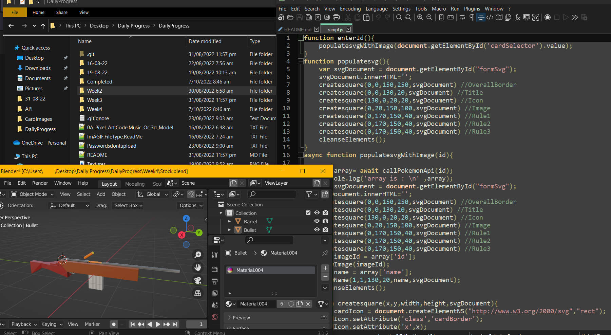

# Daily Progress -> 3D Modelling , Coding and Music Development Source Repo



## Notes/Know Bugs:

> *Important* 'Gun' has not yet been fully implemented

> The Rifle 3D Model Sometimes Has Incorrect materials selected


## Features(Planned In Brackets)

A Full web-baseed recreation of a friend's cardgame - 'Gun'

A VR Rifle Training Application

Custom 3d Models With Animations For The Above VR App

Daily Attempts At Music Creation And Remixing

A Full Discord Bot With Generically Accessible 'Dropgrid' Game Component

## View of progress

**View of latest build of project**


## Latest Build

*--/--/---- - 0 - Full Build Yet To Be Released*

*No Image*

## Latest Update Notes:

```

07/10/2020{

	"Overall Project":{
		"Readme":["Updated README file to match standardized README structure throughout other projects"],
		"File Output":["Began Creating A folder For All Outputs Combined, As Well As A Folder For Each Daily Project"]
	
	}
	
}

```

## Latest Updates

*07/10/2020 - Folder Reframe, Readme Update*

## Next Build

30/10/22 'Gun Multipalyer', VR Start App **No Delay As Of 07/10/22**

> 'Gun' Hostable, and multiplayer games capable of being played

> Simple Interactable VR Application Set Up

## Skill developing

I planned on this project improving my skills in the following:

> Cheap API Development

> Browser Multiplayer Using Servers

> Continue Updating SQL Skills

> Maintain 3D Modelling Ability

> Sound Design

> Project Documentation

## Installing and Compiling:

*'Gun' Can Be uploaded to any hosting service, with any php files having credentials for the relevant SQL server added*


*No Keys* - There are no keys that action any of the files currently in this repo


Developed by Starshiplad 

[Twitter](https://twitter.com/StarshipladDevp) 

[Discord](https://discord.gg/jAqfVpmqdA)

